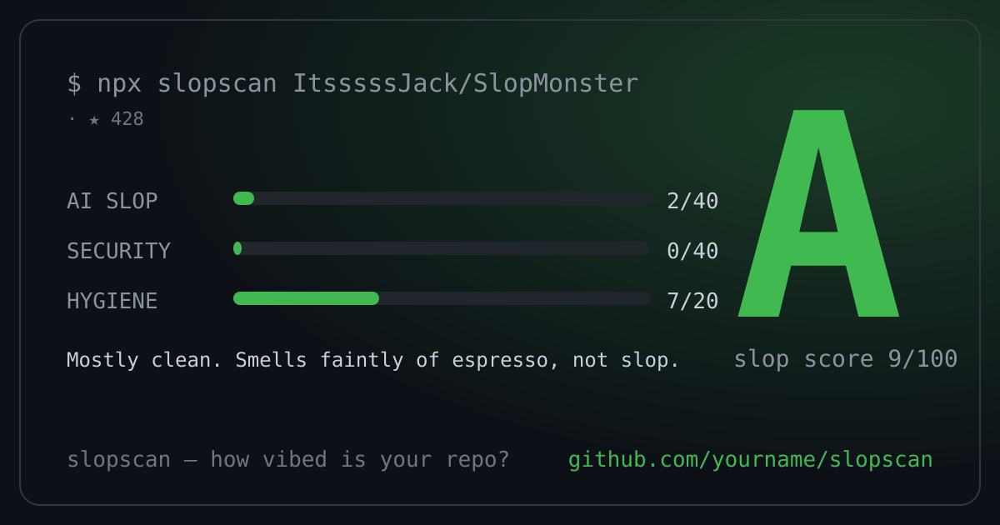

# slopgrade 🔍

**How vibed is your repo?** One command grades any GitHub repo for AI slop, sketchy agent skills, and hygiene — then generates a shareable X card so you can roast it (or flex it).

```bash
npx slopgrade anthropics/skills
```



## Why?

We all paste AI-generated code. Some of us review it. **slopgrade tells you which repos did.**

It scans for three things:

| Category | What it catches |
|---|---|
| 🫠 **AI Slop** (40 pts) | "As an AI language model..." confessions, `// your code here` placeholders, `debugger` statements, silent `catch {}`, TODO spam, `John Doe` sample data |
| 🛡️ **Security** (40 pts) | `curl \| sh` in SKILL.md files, prompt-injection overrides (`ignore all previous instructions`), credential access (`~/.ssh`, `.aws/credentials`), exfiltration endpoints, hardcoded secrets, committed private keys |
| 🧹 **Hygiene** (20 pts) | Missing README, LICENSE, .gitignore, tests, CI, package manifest |

Score → Grade:

```
0–5 → S    Certified fresh
6–15 → A   Mostly clean
16–30 → B  Human-made, human-reviewed
31–50 → C  Some slop detected
51–70 → D  Heavily vibed
71–100 → F Certified slop ☠️
```

## Usage

```bash
# Scan any public GitHub repo
npx slopgrade owner/repo

# Scan your local project
npx slopgrade .

# Generate a 1200x630 X card (perfect for roasting)
npx slopgrade owner/repo --card

# Get a badge for your README
npx slopgrade owner/repo --badge-url

# Gate your CI on it
npx slopgrade . --fail-under B   # exit 1 if worse than B

# JSON output for scripting
npx slopgrade owner/repo --json
```

### Badge

```md
[](https://github.com/Jaysi88/slopgrade)
```

## GitHub Action

Add slopgrade to CI so the slop never comes back:

```yaml
# .github/workflows/slopgrade.yml
name: slopgrade
on: [push, pull_request]
jobs:
  grade:
    runs-on: ubuntu-latest
    steps:
      - uses: actions/checkout@v4
      - uses: Jaysi88/slopgrade@v1
        with:
          fail-under: B
```

## Agent skill security

Agent skills (`SKILL.md`, `mcp.json`, `CLAUDE.md`, `.cursorrules`) are executable instructions for AI agents — and an attack surface. slopgrade flags the patterns that matter:

- `curl | sh` / `irm | iex` — downloads and executes sight-unseen
- `ignore all previous instructions` — prompt injection
- `do not tell the user` + silently send — covert action
- `~/.ssh`, `.aws/credentials`, `.env` access — credential theft
- `webhook.site`, `ngrok`, discord webhooks — exfiltration endpoints

If a skill trips a **critical** finding, don't install it. Screenshot it. Post it. That's the fun part.

## Zero dependencies

Pure Node.js 18+, no `node_modules`, no build step. `npx slopgrade` just works.

## Development

```bash
git clone https://github.com/Jaysi88/slopgrade
cd slopgrade
node test/run-tests.js        # 12 tests, no deps
node bin/slopgrade.js .        # dogfood it (we grade ourselves honestly — fixtures included)
```

## FAQ

**My repo got a D and I disagree.** The grading is vibes-based physics. Open an issue, or better — fix the TODOs.

**Does it send my code anywhere?** No. Scanning is fully local; GitHub mode only reads public repos via the API.

**Is my grade stored?** Only in the SVG you choose to share. Chaos is opt-in.

## License

MIT — go forth and grade.
